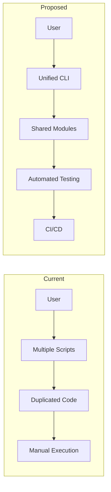
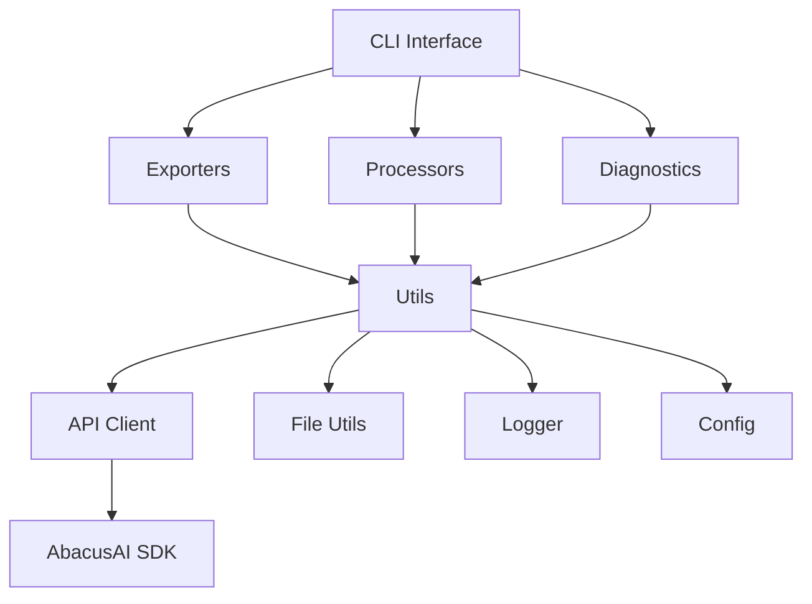

# Architecture & Structural Improvements

## Current Repository Structure

```
abacus-chat-exporter/
├── Python Scripts (13 files)
│   ├── Export Tools
│   │   ├── bulk_export_ai_chat.py
│   │   ├── bulk_export_deployment_convos.py
│   │   ├── bulk_export_all_projects.py
│   │   └── bulk_export_all_deployment_conversations.py
│   ├── PDF Processing
│   │   └── process_pdfs.py
│   └── Diagnostic Tools
│       ├── find_my_chats.py
│       ├── discover_chats.py
│       ├── explore_api.py
│       ├── explore_project_methods.py
│       ├── debug_projects.py
│       ├── search_chat.py
│       └── test_list_chats.py
├── Shell Scripts (6 files)
│   ├── export_all.sh
│   ├── process_pdfs.sh
│   ├── export_with_curl.sh
│   ├── diagnose.sh
│   ├── fix_segfault.sh
│   └── activate.sh
├── Documentation (9 files)
│   ├── README.md
│   ├── ARCHITECTURE.md (this file)
│   ├── QUICK_REFERENCE.md
│   ├── FINDING_CHATS.md
│   ├── FOUND_YOUR_CHATS.md
│   ├── NO_CHATS_FOUND.md
│   ├── PDF_PROCESSING.md
│   ├── PROJECT_SCOPED_SOLUTION.md
│   └── TROUBLESHOOTING.md
├── Configuration
│   ├── requirements.txt
│   ├── .env.example
│   └── .gitignore
└── Virtual Environment
    └── venv/
```

## Suggested Structural Improvements

### 1. Organize Scripts into Subdirectories

**Proposed Structure:**

```
abacus-chat-exporter/
├── src/
│   ├── exporters/
│   │   ├── __init__.py
│   │   ├── ai_chat_exporter.py
│   │   ├── deployment_exporter.py
│   │   └── project_exporter.py
│   ├── processors/
│   │   ├── __init__.py
│   │   └── pdf_processor.py
│   ├── diagnostics/
│   │   ├── __init__.py
│   │   ├── chat_finder.py
│   │   ├── api_explorer.py
│   │   └── project_debugger.py
│   └── utils/
│       ├── __init__.py
│       ├── api_client.py
│       ├── file_utils.py
│       └── formatters.py
├── scripts/
│   ├── export_all.sh
│   ├── process_pdfs.sh
│   ├── diagnose.sh
│   └── setup.sh
├── docs/
│   ├── README.md (symlink to ../README.md)
│   ├── QUICK_REFERENCE.md
│   ├── ARCHITECTURE.md
│   ├── guides/
│   │   ├── FINDING_CHATS.md
│   │   ├── PDF_PROCESSING.md
│   │   └── PROJECT_SCOPED_SOLUTION.md
│   └── troubleshooting/
│       ├── NO_CHATS_FOUND.md
│       ├── TROUBLESHOOTING.md
│       └── FOUND_YOUR_CHATS.md
├── tests/
│   ├── __init__.py
│   ├── test_exporters.py
│   ├── test_processors.py
│   └── test_diagnostics.py
├── examples/
│   ├── export_example.py
│   └── process_pdfs_example.py
└── (keep root level clean)
    ├── README.md
    ├── requirements.txt
    ├── .env.example
    ├── .gitignore
    └── setup.py
```

**Benefits:**
- Clear separation of concerns
- Easier navigation for developers
- Better code discoverability
- Improved maintainability
- Easier to add tests

### 2. Create Reusable Modules

**Current Issue:** Code duplication across scripts (e.g., API client initialization, file sanitization)

**Solution:** Extract common functionality into shared modules:

```python
# src/utils/api_client.py
class AbacusAPIClient:
    """Wrapper around abacusai.ApiClient with common functionality"""

    def __init__(self, api_key: str = None):
        self.api_key = api_key or os.environ.get("ABACUS_API_KEY")
        self.client = ApiClient(self.api_key)

    def list_chat_sessions(self, project_id: str = None):
        """List chat sessions with error handling"""
        pass

# src/utils/file_utils.py
def sanitize_filename(name: str, max_len: int = 80) -> str:
    """Sanitize filename - used across all export scripts"""
    pass

def save_json(data: dict, filepath: Path):
    """Save JSON with consistent formatting"""
    pass

def save_html(content: str, filepath: Path):
    """Save HTML with consistent encoding"""
    pass
```

### 3. Add Configuration Management

**Create `config.py`:**

```python
# src/config.py
from pathlib import Path
from dataclasses import dataclass
from typing import Optional

@dataclass
class ExportConfig:
    """Configuration for export operations"""
    api_key: str
    output_dir: Path = Path("exports")
    max_filename_length: int = 80
    export_json: bool = True
    export_html: bool = True

    @classmethod
    def from_env(cls):
        """Load configuration from environment"""
        return cls(
            api_key=os.environ.get("ABACUS_API_KEY"),
            output_dir=Path(os.environ.get("OUTPUT_DIR", "exports"))
        )

@dataclass
class PDFProcessorConfig:
    """Configuration for PDF processing"""
    api_key: str
    deployment_id: str
    source_dir: Path
    recursive: bool = True
    output_dir: Path = Path("pdf_processing_logs")
```

### 4. Add Logging Framework

**Replace print statements with structured logging:**

```python
# src/utils/logger.py
import logging
from pathlib import Path

def setup_logger(name: str, log_file: Path = None, level=logging.INFO):
    """Setup structured logging"""
    logger = logging.getLogger(name)
    logger.setLevel(level)

    # Console handler
    console_handler = logging.StreamHandler()
    console_handler.setFormatter(
        logging.Formatter('%(asctime)s - %(name)s - %(levelname)s - %(message)s')
    )
    logger.addHandler(console_handler)

    # File handler (optional)
    if log_file:
        file_handler = logging.FileHandler(log_file)
        file_handler.setFormatter(
            logging.Formatter('%(asctime)s - %(name)s - %(levelname)s - %(message)s')
        )
        logger.addHandler(file_handler)

    return logger
```

### 5. Add CLI with Click or Argparse

**Create unified CLI interface:**

```python
# cli.py
import click
from src.exporters import ai_chat_exporter, deployment_exporter
from src.processors import pdf_processor

@click.group()
def cli():
    """Abacus.AI Chat Exporter & PDF Processor CLI"""
    pass

@cli.command()
@click.option('--api-key', envvar='ABACUS_API_KEY', required=True)
@click.option('--output-dir', default='exports', help='Output directory')
@click.option('--format', type=click.Choice(['html', 'json', 'both']), default='both')
def export_chats(api_key, output_dir, format):
    """Export AI chat sessions"""
    click.echo(f"Exporting chats to {output_dir}...")
    # Use the refactored exporter module
    pass

@cli.command()
@click.option('--api-key', envvar='ABACUS_API_KEY', required=True)
@click.option('--deployment-id', required=True)
@click.option('--source-dir', type=click.Path(exists=True), required=True)
@click.option('--recursive/--no-recursive', default=True)
def process_pdfs(api_key, deployment_id, source_dir, recursive):
    """Process PDFs in batch"""
    click.echo(f"Processing PDFs from {source_dir}...")
    # Use the refactored processor module
    pass

@cli.command()
def diagnose():
    """Run diagnostic tools to find chats"""
    click.echo("Running diagnostics...")
    pass

if __name__ == '__main__':
    cli()
```

**Usage:**
```bash
python cli.py export-chats --output-dir my_exports
python cli.py process-pdfs --deployment-id abc123 --source-dir ./pdfs
python cli.py diagnose
```

### 6. Add Tests

**Create test suite:**

```
tests/
├── __init__.py
├── conftest.py  # Pytest fixtures
├── test_exporters/
│   ├── test_ai_chat_exporter.py
│   └── test_deployment_exporter.py
├── test_processors/
│   └── test_pdf_processor.py
├── test_utils/
│   ├── test_file_utils.py
│   └── test_api_client.py
└── fixtures/
    ├── sample_chat.json
    └── sample_response.html
```

### 7. Add Package Setup

**Create `setup.py` or `pyproject.toml`:**

```toml
# pyproject.toml
[build-system]
requires = ["setuptools>=45", "wheel"]
build-backend = "setuptools.build_meta"

[project]
name = "abacus-chat-exporter"
version = "1.0.0"
description = "Export chats and process PDFs from Abacus.AI"
authors = [{name = "Your Name"}]
requires-python = ">=3.9"
dependencies = [
    "abacusai>=2.0.0",
    "click>=8.0.0",
    "python-dotenv>=1.0.0",
]

[project.optional-dependencies]
dev = [
    "pytest>=7.0.0",
    "pytest-cov>=4.0.0",
    "black>=23.0.0",
    "flake8>=6.0.0",
]

[project.scripts]
abacus-export = "src.cli:cli"
```

### 8. Documentation Improvements

**Add inline diagrams to existing docs:**

1. **QUICK_REFERENCE.md** - Add decision flowchart
2. **PDF_PROCESSING.md** - Add detailed process diagram
3. **FINDING_CHATS.md** - Add troubleshooting flowchart

**Create new docs:**
- **CONTRIBUTING.md** - Guidelines for contributors
- **API.md** - API reference for the modules
- **EXAMPLES.md** - Code examples and use cases

### 9. CI/CD Pipeline

**Add `.github/workflows/`:**

```yaml
# .github/workflows/test.yml
name: Tests
on: [push, pull_request]
jobs:
  test:
    runs-on: ubuntu-latest
    steps:
      - uses: actions/checkout@v3
      - uses: actions/setup-python@v4
        with:
          python-version: '3.9'
      - run: pip install -e .[dev]
      - run: pytest tests/
      - run: black --check src/
      - run: flake8 src/
```

### 10. Environment Management

**Improve `.env.example`:**

```bash
# .env.example - Comprehensive environment variables

# Required
ABACUS_API_KEY=your-api-key-here

# Optional - Export Configuration
EXPORT_OUTPUT_DIR=./exports
EXPORT_FORMAT=both  # html, json, or both
MAX_FILENAME_LENGTH=80

# Optional - PDF Processing
PDF_OUTPUT_DIR=./pdf_processing_logs
DEFAULT_DEPLOYMENT_ID=

# Optional - Logging
LOG_LEVEL=INFO
LOG_FILE=./logs/abacus-exporter.log

# Optional - API Configuration
API_TIMEOUT=30
API_RETRY_COUNT=3
```

## Implementation Priority

### Phase 1: Quick Wins (High Impact, Low Effort)
1. Add mermaid diagrams to README (✓ Completed)
2. Create ARCHITECTURE.md (✓ In Progress)
3. Add structured logging to existing scripts
4. Improve .env.example with more options

### Phase 2: Code Organization (Medium Impact, Medium Effort)
1. Extract common utilities into `src/utils/`
2. Create configuration management
3. Organize documentation into `docs/` folder
4. Add CLI interface with Click

### Phase 3: Refactoring (High Impact, High Effort)
1. Reorganize scripts into `src/` packages
2. Add comprehensive test suite
3. Create `setup.py`/`pyproject.toml`
4. Set up CI/CD pipeline

### Phase 4: Enhancement (Medium Impact, Variable Effort)
1. Add more diagnostic tools
2. Improve error handling and recovery
3. Add progress bars and better UX
4. Create web dashboard (optional)

## Benefits of Proposed Changes

### For Users
- Clearer documentation with visual diagrams
- Easier troubleshooting with decision trees
- Better error messages and logging
- Single CLI command instead of multiple scripts

### For Developers
- Better code organization and discoverability
- Reusable modules reduce duplication
- Tests ensure reliability
- Clear separation of concerns
- Easier to contribute and extend

### For Maintenance
- Consistent coding patterns
- Automated testing catches regressions
- Better logging aids debugging
- Configuration management simplifies deployment

## Migration Path

To migrate to the new structure without breaking existing users:

1. **Keep backward compatibility:** Maintain existing scripts as thin wrappers
2. **Gradual migration:** Move functionality to new modules incrementally
3. **Update documentation:** Clearly mark deprecated vs. new approaches
4. **Provide migration guide:** Help users transition to new CLI
5. **Deprecation timeline:** Give 2-3 releases before removing old scripts

## Visual Reference

### Current vs. Proposed Workflow



### Module Dependencies



## Conclusion

These improvements will transform the repository from a collection of scripts into a well-structured, maintainable Python package while preserving the simplicity that makes it accessible to users.

The modular approach allows for:
- Incremental adoption
- Backward compatibility
- Better testing
- Easier maintenance
- Community contributions
