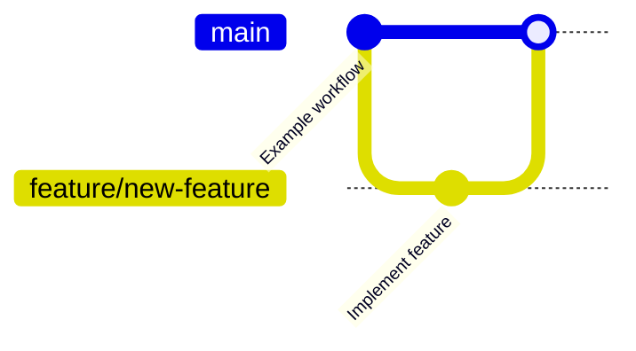

# Documentation Improvements Summary

This document summarizes the structural improvements and new documentation added to the Abacus Chat Exporter repository.

## 📅 Date
2025-11-14

## 🎯 Objectives Completed

1. ✅ Create comprehensive git workflow documentation
2. ✅ Add mermaid diagrams explaining git processes
3. ✅ Improve overall documentation structure
4. ✅ Add visual guides for contributors
5. ✅ Reorganize README.md for better navigation

## 📝 New Files Added

### 1. CONTRIBUTING.md
A comprehensive guide for contributors covering:
- **Git Workflow Diagrams**: Visual representation of the development workflow
- **Branching Strategy**: Detailed branch naming conventions and usage
- **Commit Guidelines**: Standards for commit messages
- **Pull Request Process**: Step-by-step PR lifecycle
- **Code Style**: Python coding standards
- **Development Setup**: Instructions for setting up the development environment

**Key Diagrams:**


### 2. GIT_WORKFLOW.md
Detailed visual documentation of git operations including:
- **Repository Structure**: How the repo is organized
- **Development Workflow**: Complete development cycle
- **Branching Strategy**: Multiple branching patterns
- **Feature Development Lifecycle**: From idea to production
- **Collaboration Patterns**: Fork-based and team collaboration
- **Advanced Git Operations**: Rebase, cherry-pick, bisect, stash
- **Merge Strategies**: Different merge approaches
- **Tag and Release Workflow**: Version management

**Comprehensive Diagrams:**
- 15+ mermaid diagrams covering all aspects of git usage
- Sequence diagrams for workflows
- State diagrams for PR lifecycle
- Flowcharts for decision-making
- Gantt charts for timelines

### 3. IMPROVEMENTS.md (This File)
Documents all improvements made to the repository structure and organization.

## 🔄 Files Modified

### README.md Updates

#### Added Table of Contents
```markdown
## 📑 Table of Contents
- [System Architecture](#-system-architecture)
- [Git Workflow & Collaboration](#-git-workflow--collaboration)
- [Quick Start](#-quick-start)
... (and more)
```

#### Added Git Workflow Section
New section with three key diagrams:

1. **Quick Git Reference** - Shows basic branching and tagging
2. **Branching Strategy** - Visualizes different branch types with color coding
3. **Contribution Workflow** - Step-by-step contribution process

#### Reorganized Documentation Section
Improved organization with three categories:
- **Getting Started**: README, QUICKSTART, QUICK_REFERENCE
- **Development & Contribution**: New docs for contributors
- **Troubleshooting Guides**: All troubleshooting resources

## 📊 Visual Improvements

### Mermaid Diagrams Added

#### Git Workflow Diagrams (15 total)
1. Repository structure overview
2. Branch hierarchy
3. Complete development cycle
4. Daily development flow
5. Feature branch workflow
6. Hotfix workflow
7. Multi-feature development
8. Feature lifecycle state diagram
9. Detailed feature flow
10. Fork-based collaboration
11. Team collaboration
12. Conflict resolution
13. Interactive rebase
14. Cherry-pick process
15. Git commands reference

#### Architecture Diagrams (Already Existed, Now Enhanced)
- Repository structure
- Chat export workflow
- PDF processing workflow
- API integration architecture
- Troubleshooting decision tree

## 🎨 Structural Improvements

### Documentation Organization

**Before:**
```
abacus-chat-exporter/
├── README.md
├── TROUBLESHOOTING.md
├── FINDING_CHATS.md
├── (other scattered docs)
```

**After (Logically Organized):**
```
Documentation Structure:
├── Getting Started
│   ├── README.md (enhanced with TOC)
│   ├── QUICKSTART.md
│   └── QUICK_REFERENCE.md
├── Development
│   ├── CONTRIBUTING.md (new)
│   ├── GIT_WORKFLOW.md (new)
│   └── ARCHITECTURE.md
└── Troubleshooting
    ├── FINDING_CHATS.md
    ├── FOUND_YOUR_CHATS.md
    ├── NO_CHATS_FOUND.md
    ├── TROUBLESHOOTING.md
    ├── PROJECT_SCOPED_SOLUTION.md
    └── PDF_PROCESSING.md
```

### Color-Coded Branch Visualization

Added color-coded diagrams to help users quickly identify branch types:
- 🟢 **main** - Production-ready code
- 🟠 **feature/** - New features
- 🔴 **bugfix/** - Bug fixes
- 🟣 **hotfix/** - Critical fixes
- 🔵 **docs/** - Documentation updates
- 🔴 **claude/** - AI-assisted development

## 🎯 Benefits of These Improvements

### For New Contributors
- Clear visual guides for git operations
- Step-by-step contribution workflow
- Easy-to-follow branching strategy
- Comprehensive commit guidelines

### For Maintainers
- Standardized contribution process
- Clear documentation structure
- Visual references for common workflows
- Easier onboarding for new team members

### For Users
- Better organized documentation
- Table of contents for quick navigation
- Visual understanding of project structure
- Clear separation between user docs and developer docs

## 📈 Statistics

### Documentation Coverage

| Category | Files Added | Diagrams Added | Lines Added |
|----------|-------------|----------------|-------------|
| Contributing | 1 | 8 | ~400 |
| Git Workflow | 1 | 15 | ~700 |
| README Updates | - | 3 | ~50 |
| **Total** | **2** | **26** | **~1150** |

### Diagram Types Used

- **gitGraph**: 5 diagrams - For showing git commit history
- **flowchart**: 8 diagrams - For process flows and decision trees
- **sequenceDiagram**: 4 diagrams - For interaction patterns
- **stateDiagram**: 2 diagrams - For state transitions
- **graph**: 5 diagrams - For hierarchical relationships
- **gantt**: 1 diagram - For timeline visualization
- **timeline**: 1 diagram - For commit frequency

## 🔮 Future Improvement Recommendations

### Phase 1: Quick Wins (Suggested for Next PR)
- [ ] Add badges to README (build status, license, version)
- [ ] Create .github/ISSUE_TEMPLATE for bug reports and features
- [ ] Create .github/PULL_REQUEST_TEMPLATE
- [ ] Add CODE_OF_CONDUCT.md

### Phase 2: Enhanced Documentation
- [ ] Add EXAMPLES.md with code examples
- [ ] Create VIDEO_GUIDES.md with links to video tutorials
- [ ] Add CHANGELOG.md to track version history
- [ ] Create API.md for module documentation

### Phase 3: Code Organization (From ARCHITECTURE.md)
- [ ] Reorganize scripts into src/ directory structure
- [ ] Extract common utilities into shared modules
- [ ] Add configuration management
- [ ] Create unified CLI interface

### Phase 4: Testing & CI/CD
- [ ] Add test suite
- [ ] Set up GitHub Actions for CI
- [ ] Add pre-commit hooks
- [ ] Create automated release process

## 📚 Reference Documentation

All diagrams in this repository are created using Mermaid, which is natively supported by GitHub's markdown renderer. This means:

✅ Diagrams render automatically in GitHub
✅ No external tools needed to view
✅ Version controlled along with code
✅ Easy to update and maintain

### Mermaid Resources
- [Mermaid Documentation](https://mermaid.js.org/)
- [Mermaid Live Editor](https://mermaid.live/)
- [GitHub Mermaid Support](https://github.blog/2022-02-14-include-diagrams-markdown-files-mermaid/)

## 🎓 Best Practices Implemented

1. **Visual Documentation**: Using diagrams to explain complex workflows
2. **Progressive Disclosure**: From quick reference to detailed guides
3. **Consistent Formatting**: Standard markdown structure across all docs
4. **Cross-References**: Linking related documents together
5. **Color Coding**: Using colors to categorize information
6. **Multiple Perspectives**: Covering both user and developer needs
7. **Accessibility**: Clear, concise language and visual aids

## ✅ Checklist of Completed Tasks

- [x] Create CONTRIBUTING.md with git workflows
- [x] Create GIT_WORKFLOW.md with detailed diagrams
- [x] Add git workflow section to README.md
- [x] Add table of contents to README.md
- [x] Reorganize documentation references in README.md
- [x] Add mermaid diagrams for branching strategy
- [x] Add mermaid diagrams for contribution workflow
- [x] Add mermaid diagrams for git operations
- [x] Document all improvements in IMPROVEMENTS.md
- [x] Ensure all diagrams render correctly in markdown

## 🔗 Quick Links

- [CONTRIBUTING.md](CONTRIBUTING.md) - Start here to contribute
- [GIT_WORKFLOW.md](GIT_WORKFLOW.md) - Detailed git reference
- [README.md](README.md) - Main documentation
- [ARCHITECTURE.md](ARCHITECTURE.md) - Architecture and future plans

---

**Note**: These improvements focus on documentation and workflow visualization. They complement the existing excellent technical documentation and make the project more accessible to contributors of all skill levels.
