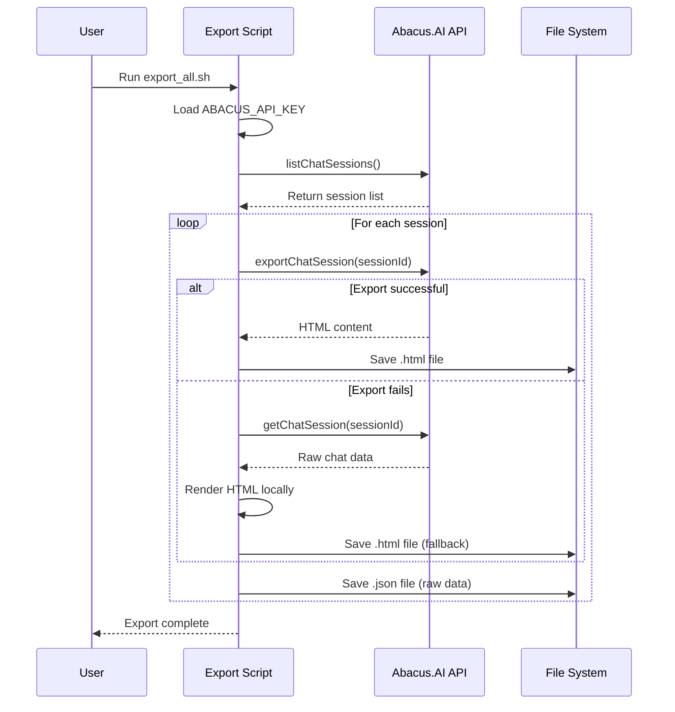
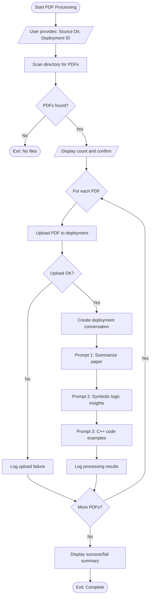
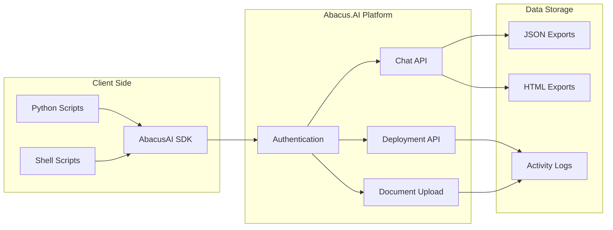
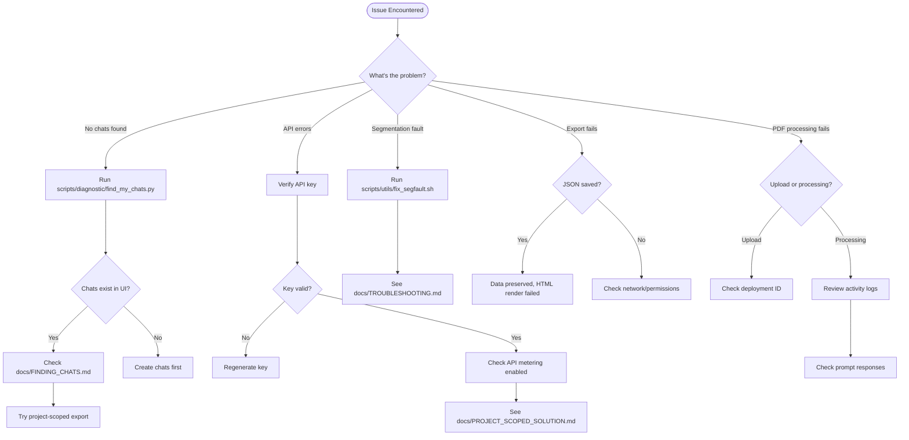
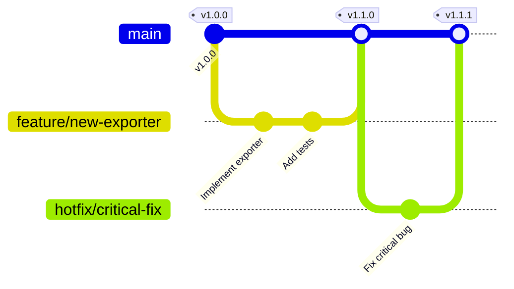
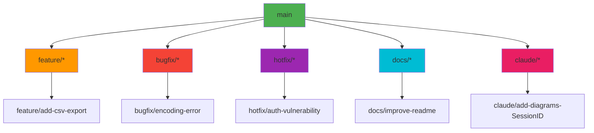
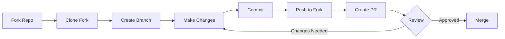

# Abacus.AI Chat Exporter & PDF Processor

Thinking of leaving abacus.ai but can't seem to find anyway to take your data with you?

Then the Abacus.ai Chat Exporter is for you!

**Two powerful tools for Abacus.AI:**
1. 💬 **Chat Exporter**: Bulk download your chat conversations to HTML and JSON format
2. 📄 **PDF Processor**: Batch upload and process PDFs with automated prompts

## 📑 Table of Contents

- [System Architecture](#-system-architecture)
- [Git Workflow & Collaboration](#-git-workflow--collaboration)
- [Quick Start](#-quick-start)
- [Setup](#setup)
- [Usage](#usage)
- [Output Format](#output-format)
- [Advanced Usage](#advanced-usage)
- [API Documentation](#api-documentation)
- [Compliance](#compliance)
- [Troubleshooting](#troubleshooting)
- [Project Files](#project-files)
- [License](#license)

## 📊 System Architecture

### Repository Structure

```mermaid
graph TD
    A[Abacus Chat Exporter] --> B[Export Tools]
    A --> C[PDF Processing]
    A --> D[Diagnostic Tools]
    A --> E[Documentation]

    B --> B1[scripts/export/bulk_export_ai_chat.py]
    B --> B2[scripts/export/bulk_export_deployment_convos.py]
    B --> B3[scripts/export/bulk_export_all_projects.py]
    B --> B4[scripts/export/export_all.sh]

    C --> C1[scripts/pdf/process_pdfs.py]
    C --> C2[scripts/pdf/process_pdfs.sh]

    D --> D1[scripts/diagnostic/find_my_chats.py]
    D --> D2[scripts/diagnostic/discover_chats.py]
    D --> D3[scripts/diagnostic/explore_api.py]
    D --> D4[scripts/diagnostic/diagnose.sh]

    E --> E1[README.md]
    E --> E2[docs/QUICK_REFERENCE.md]
    E --> E3[docs/FINDING_CHATS.md]
    E --> E4[docs/PDF_PROCESSING.md]
    E --> E5[docs/TROUBLESHOOTING.md]
```



### Chat Export Workflow



### PDF Processing Workflow



### API Integration Architecture



### Troubleshooting Decision Tree



## 🔀 Git Workflow & Collaboration

This repository follows a structured git workflow for development and collaboration. Whether you're contributing code, fixing bugs, or improving documentation, understanding our git practices will help you contribute effectively.

### Quick Git Reference



### Branching Strategy



### Contribution Workflow



### Documentation

- **[CONTRIBUTING.md](docs/CONTRIBUTING.md)** - Complete guide to contributing, including git workflows, commit guidelines, and PR process
- **[GIT_WORKFLOW.md](docs/GIT_WORKFLOW.md)** - Detailed visual guides for git operations, branching strategies, and collaboration patterns
- **[ARCHITECTURE.md](docs/ARCHITECTURE.md)** - System architecture and proposed structural improvements

## 🚀 Quick Start

### Export Chats

**Export all chats from all projects:**

```bash
cd ~/programs/abacus-chat-exporter
source venv/bin/activate
export ABACUS_API_KEY="your-key"

# Run the export
./scripts/export/export_all.sh
```

### ⚠️ Important: Do You Have Chats to Export?

**If the export completes but folders are empty:**
- You may not have created any chats yet
- Go to https://abacus.ai and verify chats exist in the web UI
- See **[NO_CHATS_FOUND.md](docs/NO_CHATS_FOUND.md)** for diagnosis

**If you're seeing API errors:**
- See **[PROJECT_SCOPED_SOLUTION.md](docs/PROJECT_SCOPED_SOLUTION.md)**
- Or **[QUICK_REFERENCE.md](docs/QUICK_REFERENCE.md)** for troubleshooting

### Process PDFs

**Batch upload and process PDFs with automated prompts:**

```bash
./scripts/pdf/process_pdfs.sh
```

See **[PDF_PROCESSING.md](docs/PDF_PROCESSING.md)** for detailed documentation.

## Overview

### Chat Exporter
Abacus.AI provides APIs to list and export chat sessions. This tool includes scripts for:

- **Option A**: Exporting "Data Science Copilot" chats (AI Chat)
- **Option B**: Exporting "Deployment Conversations" (production assistant chats)
- **Diagnostic Tools**: Find where your chats are stored

### PDF Processor
Automates bulk PDF uploads to Abacus.AI with three-stage processing:
1. Summarize the paper
2. Extract insights using symbolic logic
3. Demonstrate insights with C++ code examples

## Setup

### 1. Install Dependencies

The project includes a pre-configured Python 3.13 virtual environment. Activate it:

```bash
cd ~/programs/abacus-chat-exporter
source venv/bin/activate
```

Or if starting fresh:

```bash
python3 -m venv venv
source venv/bin/activate
pip install -r requirements.txt
```

### 2. Get Your API Key

1. Log into Abacus.AI
2. Navigate to **Settings → Profile & Billing**
3. Enable API metering
4. Go to **API Keys Dashboard** and create a new key
5. Save your key securely

## Usage

### Option A: Export AI Chat Sessions

Export all your Data Science Copilot chat sessions:

```bash
export ABACUS_API_KEY="your-api-key-here"
python scripts/export/bulk_export_ai_chat.py
```

This will create a folder `abacus_ai_chat_exports/` containing:
- `.html` files for human-readable chat history
- `.json` files for full fidelity data (can be used to rehydrate later)

### Option B: Export Deployment Conversations

Export conversations from a specific deployed assistant:

```bash
export ABACUS_API_KEY="your-api-key-here"
export DEPLOYMENT_ID="your-deployment-id"
python scripts/export/bulk_export_deployment_convos.py
```

This will create a folder `abacus_deployment_{DEPLOYMENT_ID}_exports/` with HTML exports.

## Output Format

### File Naming

Files are named with the pattern: `{timestamp}__{name}__{id}.{ext}`

Example: `2025-10-21T10-30-00__my_chat_session__abc123.html`

### HTML Exports

Human-readable chat history with formatting and structure preserved.

### JSON Exports (AI Chat only)

Complete data dump including:
- Chat session metadata
- Full message history
- Timestamps
- All custom fields

## Advanced Usage

### Using cURL

If you prefer shell scripting:

```bash
# List all AI Chat sessions
curl -s -H "x-api-key: $ABACUS_API_KEY" \
  "https://api.abacus.ai/api/v0/listChatSessions" > sessions.json

# Export a specific session
curl -s -X POST -H "x-api-key: $ABACUS_API_KEY" \
  -H "Content-Type: application/json" \
  -d '{"chatSessionId": "your-session-id"}' \
  "https://api.abacus.ai/api/v0/exportChatSession" > export.html
```

## API Documentation

- [listChatSessions](https://abacus.ai/help/api/ref/ai_chat/listChatSessions)
- [exportChatSession](https://abacus.ai/help/api/ref/ai_chat/exportChatSession)
- [exportDeploymentConversation](https://abacus.ai/help/ref/deployment_conversations/exportDeploymentConversation)
- [Python SDK Guide](https://abacus.ai/help/sdk)

## Compliance

For full account-level data exports (GDPR/CCPA requests), contact Abacus.AI support. They honor data access requests with a ~15-day turnaround.

## Troubleshooting

### No Chats Found

If the export script reports "No chat sessions found":

1. **Run the discovery tool:**
   ```bash
   source venv/bin/activate
   export ABACUS_API_KEY="your-key"
   python scripts/diagnostic/discover_chats.py
   ```

2. **Check the web interface:**
   - Visit https://abacus.ai and verify you have chats
   - Note the URL pattern when viewing a chat
   - See `docs/FINDING_CHATS.md` for detailed guidance

3. **Explore API methods:**
   ```bash
   python scripts/diagnostic/explore_api.py
   ```

### Authentication Issues

- Verify your API key is correct
- Ensure API metering is enabled in your account
- Check that the key has not expired

### Export Failures

The scripts include fallback mechanisms:
- If `exportChatSession` fails, the script will fetch raw data via `getChatSession` and render HTML locally
- Both HTML and JSON are saved to preserve data integrity

### Segmentation Faults

If you get segmentation faults (exit code 139):
```bash
./scripts/utils/fix_segfault.sh
```
See `docs/TROUBLESHOOTING.md` for details.

## Project Files

### Export Scripts (`scripts/export/`)
- `bulk_export_ai_chat.py` - Export AI Chat sessions
- `bulk_export_deployment_convos.py` - Export deployment conversations
- `export_all.sh` - Convenience wrapper for both exports
- `export_with_curl.sh` - Alternative shell-based exporter

### PDF Processing (`scripts/pdf/`)
- `process_pdfs.py` - Batch PDF upload and processing
- `process_pdfs.sh` - Shell wrapper for PDF processing

### Diagnostic Tools (`scripts/diagnostic/`)
- `find_my_chats.py` - 🎯 **Start here** - Comprehensive chat finder
- `discover_chats.py` - Scan all account resources
- `explore_api.py` - List all available API methods
- `diagnose.sh` - Interactive diagnostic tool

### Utilities (`scripts/utils/`)
- `activate.sh` - Activate virtual environment
- `fix_segfault.sh` - Fix Python 3.13 compatibility issues
- `test_list_chats.py` - Test API connection

### Documentation

#### Getting Started
- `README.md` - This file (main documentation)
- `docs/QUICKSTART.md` - Basic setup and usage
- `docs/QUICK_REFERENCE.md` - Fast lookup for finding & exporting

#### Development & Contribution
- `docs/CONTRIBUTING.md` - Contributing guide with git workflows
- `docs/GIT_WORKFLOW.md` - Detailed git workflow diagrams and best practices
- `docs/ARCHITECTURE.md` - System architecture and improvement proposals

#### Troubleshooting Guides
- `docs/FINDING_CHATS.md` - Detailed troubleshooting for missing chats
- `docs/FOUND_YOUR_CHATS.md` - What to do when you find your chats
- `docs/NO_CHATS_FOUND.md` - Diagnosis when no chats are found
- `docs/TROUBLESHOOTING.md` - Fix common issues
- `docs/PROJECT_SCOPED_SOLUTION.md` - Project-scoped API solutions
- `docs/PDF_PROCESSING.md` - PDF processing documentation

## License

Free to use and modify for personal or commercial use.
