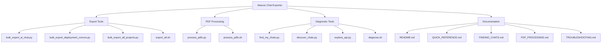
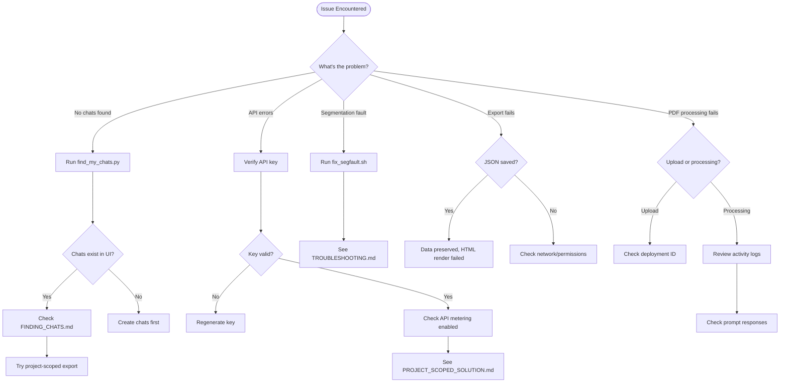

# Abacus.AI Chat Exporter & PDF Processor

[](https://github.com/danindiana/abacus-chat-exporter/actions/workflows/tests.yml)
[](https://codecov.io/gh/danindiana/abacus-chat-exporter)
[](https://www.python.org/downloads/)
[](https://github.com/psf/black)
[](https://opensource.org/licenses/MIT)
[](CONTRIBUTING.md)

Thinking of leaving abacus.ai but can't seem to find anyway to take your data with you?

Then the Abacus.ai Chat Exporter is for you!

**Two powerful tools for Abacus.AI:**
1. 💬 **Chat Exporter**: Bulk download your chat conversations to HTML and JSON format
2. 📄 **PDF Processor**: Batch upload and process PDFs with automated prompts

**✨ Features:**
- 🔄 Comprehensive test coverage (100+ tests)
- 🔒 Pre-commit hooks for code quality
- 🎯 CI/CD with GitHub Actions
- 📊 Multiple export formats (HTML, JSON)
- 🛡️ Error recovery and fallback mechanisms

## 📑 Table of Contents

- [System Architecture](#-system-architecture)
- [Git Workflow & Collaboration](#-git-workflow--collaboration)
- [Quick Start](#-quick-start)
- [Setup](#setup)
- [Usage](#usage)
- [Output Format](#output-format)
- [Testing](#-testing)
- [Development](#-development)
- [Advanced Usage](#advanced-usage)
- [API Documentation](#api-documentation)
- [Compliance](#compliance)
- [Troubleshooting](#troubleshooting)
- [Project Files](#project-files)
- [License](#license)

## 📊 System Architecture

### Repository Structure



### Chat Export Workflow


### PDF Processing Workflow


### API Integration Architecture


### Troubleshooting Decision Tree



## 🔀 Git Workflow & Collaboration

This repository follows a structured git workflow for development and collaboration. Whether you're contributing code, fixing bugs, or improving documentation, understanding our git practices will help you contribute effectively.

### Quick Git Reference


### Branching Strategy


### Contribution Workflow


### Documentation

- **[CONTRIBUTING.md](CONTRIBUTING.md)** - Complete guide to contributing, including git workflows, commit guidelines, and PR process
- **[GIT_WORKFLOW.md](GIT_WORKFLOW.md)** - Detailed visual guides for git operations, branching strategies, and collaboration patterns
- **[ARCHITECTURE.md](ARCHITECTURE.md)** - System architecture and proposed structural improvements

## 🚀 Quick Start

### Export Chats

**Export all chats from all projects:**

```bash
cd ~/programs/abacus-chat-exporter
source venv/bin/activate
export ABACUS_API_KEY="your-key"

# Run the export
./export_all.sh
```

### ⚠️ Important: Do You Have Chats to Export?

**If the export completes but folders are empty:**
- You may not have created any chats yet
- Go to https://abacus.ai and verify chats exist in the web UI
- See **[NO_CHATS_FOUND.md](NO_CHATS_FOUND.md)** for diagnosis

**If you're seeing API errors:**
- See **[PROJECT_SCOPED_SOLUTION.md](PROJECT_SCOPED_SOLUTION.md)** 
- Or **[QUICK_REFERENCE.md](QUICK_REFERENCE.md)** for troubleshooting

### Process PDFs

**Batch upload and process PDFs with automated prompts:**

```bash
./process_pdfs.sh
```

See **[PDF_PROCESSING.md](PDF_PROCESSING.md)** for detailed documentation.

## Overview

### Chat Exporter
Abacus.AI provides APIs to list and export chat sessions. This tool includes scripts for:

- **Option A**: Exporting "Data Science Copilot" chats (AI Chat)
- **Option B**: Exporting "Deployment Conversations" (production assistant chats)
- **Diagnostic Tools**: Find where your chats are stored

### PDF Processor
Automates bulk PDF uploads to Abacus.AI with three-stage processing:
1. Summarize the paper
2. Extract insights using symbolic logic
3. Demonstrate insights with C++ code examples

## Setup

### 1. Install Dependencies

The project includes a pre-configured Python 3.13 virtual environment. Activate it:

```bash
cd ~/programs/abacus-chat-exporter
source venv/bin/activate
```

Or if starting fresh:

```bash
python3 -m venv venv
source venv/bin/activate
pip install -r requirements.txt
```

### 2. Get Your API Key

1. Log into Abacus.AI
2. Navigate to **Settings → Profile & Billing**
3. Enable API metering
4. Go to **API Keys Dashboard** and create a new key
5. Save your key securely

## Usage

### Option A: Export AI Chat Sessions

Export all your Data Science Copilot chat sessions:

```bash
export ABACUS_API_KEY="your-api-key-here"
python bulk_export_ai_chat.py
```

This will create a folder `abacus_ai_chat_exports/` containing:
- `.html` files for human-readable chat history
- `.json` files for full fidelity data (can be used to rehydrate later)

### Option B: Export Deployment Conversations

Export conversations from a specific deployed assistant:

```bash
export ABACUS_API_KEY="your-api-key-here"
export DEPLOYMENT_ID="your-deployment-id"
python bulk_export_deployment_convos.py
```

This will create a folder `abacus_deployment_{DEPLOYMENT_ID}_exports/` with HTML exports.

## Output Format

### File Naming

Files are named with the pattern: `{timestamp}__{name}__{id}.{ext}`

Example: `2025-10-21T10-30-00__my_chat_session__abc123.html`

### HTML Exports

Human-readable chat history with formatting and structure preserved.

### JSON Exports (AI Chat only)

Complete data dump including:
- Chat session metadata
- Full message history
- Timestamps
- All custom fields

## 🧪 Testing

This project includes a comprehensive test suite with 100+ tests covering all major functionality.

### Quick Test Commands

```bash
# Install test dependencies
pip install -r requirements-test.txt

# Run all tests
pytest

# Run with coverage report
pytest --cov=. --cov-report=html

# View coverage report
open htmlcov/index.html  # macOS
xdg-open htmlcov/index.html  # Linux

# Run only fast unit tests
pytest -m unit

# Run specific test file
pytest tests/unit/test_sanitizers.py
```

### Test Organization

- **Unit Tests** (`tests/unit/`) - Test individual functions in isolation
  - `test_sanitizers.py` - 50+ tests for filename sanitization
  - `test_exporters.py` - 30+ tests for export functionality
  - `test_pdf_processor.py` - 30+ tests for PDF processing

- **Integration Tests** (`tests/integration/`) - Test complete workflows
  - `test_workflows.py` - End-to-end workflow tests

### Coverage Goals

- **Overall Coverage**: 80%+ ✅
- **Critical Functions**: 90%+ ✅
- **Utility Functions**: 100% ✅

### Continuous Integration

Tests run automatically on:
- Every push to `main`, `develop`, and `claude/*` branches
- Every pull request
- Multiple OS (Ubuntu, macOS, Windows)
- Python 3.8, 3.9, 3.10, 3.11, 3.12

See the [Tests README](tests/README.md) for detailed testing documentation.

## 👨‍💻 Development

### Setting Up Development Environment

```bash
# Clone the repository
git clone https://github.com/danindiana/abacus-chat-exporter.git
cd abacus-chat-exporter

# Create virtual environment
python3 -m venv venv
source venv/bin/activate

# Install dependencies
pip install -r requirements.txt
pip install -r requirements-test.txt

# Install pre-commit hooks (recommended)
pip install pre-commit
pre-commit install
```

### Pre-commit Hooks

This project uses pre-commit hooks to ensure code quality:

```bash
# Install hooks
pre-commit install

# Run hooks manually on all files
pre-commit run --all-files
```

The hooks will automatically:
- ✅ Format code with Black
- ✅ Sort imports with isort
- ✅ Check for syntax errors
- ✅ Run fast unit tests
- ✅ Check for security issues
- ✅ Detect secrets in code
- ✅ Validate YAML/JSON files

### Code Quality Standards

- **Formatting**: Black (line length 100)
- **Import Sorting**: isort (Black-compatible)
- **Linting**: flake8
- **Type Checking**: mypy (optional)
- **Security**: bandit, detect-secrets
- **Testing**: pytest with 80%+ coverage

### Running Quality Checks

```bash
# Format code
black .

# Sort imports
isort .

# Run linter
flake8 .

# Type checking
mypy *.py

# Security scan
bandit -r .

# All checks (via pre-commit)
pre-commit run --all-files
```

### Project Structure

```
abacus-chat-exporter/
├── .github/
│   └── workflows/
│       └── tests.yml          # CI/CD pipeline
├── tests/
│   ├── unit/                  # Unit tests
│   ├── integration/           # Integration tests
│   ├── conftest.py            # Test fixtures
│   └── README.md              # Testing guide
├── *.py                       # Main scripts
├── pytest.ini                 # Pytest configuration
├── pyproject.toml             # Tool configuration
├── .pre-commit-config.yaml    # Pre-commit hooks
├── requirements.txt           # Production dependencies
└── requirements-test.txt      # Development/test dependencies
```

### Contributing

We welcome contributions! Please see:
- [CONTRIBUTING.md](CONTRIBUTING.md) - Contribution guidelines
- [GIT_WORKFLOW.md](GIT_WORKFLOW.md) - Git workflow and branching strategy
- [ARCHITECTURE.md](ARCHITECTURE.md) - System architecture

Before submitting a PR:
1. ✅ Write tests for new functionality
2. ✅ Ensure all tests pass (`pytest`)
3. ✅ Run pre-commit hooks (`pre-commit run --all-files`)
4. ✅ Update documentation as needed
5. ✅ Follow the git workflow guidelines

## Advanced Usage

### Using cURL

If you prefer shell scripting:

```bash
# List all AI Chat sessions
curl -s -H "x-api-key: $ABACUS_API_KEY" \
  "https://api.abacus.ai/api/v0/listChatSessions" > sessions.json

# Export a specific session
curl -s -X POST -H "x-api-key: $ABACUS_API_KEY" \
  -H "Content-Type: application/json" \
  -d '{"chatSessionId": "your-session-id"}' \
  "https://api.abacus.ai/api/v0/exportChatSession" > export.html
```

## API Documentation

- [listChatSessions](https://abacus.ai/help/api/ref/ai_chat/listChatSessions)
- [exportChatSession](https://abacus.ai/help/api/ref/ai_chat/exportChatSession)
- [exportDeploymentConversation](https://abacus.ai/help/ref/deployment_conversations/exportDeploymentConversation)
- [Python SDK Guide](https://abacus.ai/help/sdk)

## Compliance

For full account-level data exports (GDPR/CCPA requests), contact Abacus.AI support. They honor data access requests with a ~15-day turnaround.

## Troubleshooting

### No Chats Found

If the export script reports "No chat sessions found":

1. **Run the discovery tool:**
   ```bash
   source venv/bin/activate
   export ABACUS_API_KEY="your-key"
   python discover_chats.py
   ```

2. **Check the web interface:**
   - Visit https://abacus.ai and verify you have chats
   - Note the URL pattern when viewing a chat
   - See `FINDING_CHATS.md` for detailed guidance

3. **Explore API methods:**
   ```bash
   python explore_api.py
   ```

### Authentication Issues

- Verify your API key is correct
- Ensure API metering is enabled in your account
- Check that the key has not expired

### Export Failures

The scripts include fallback mechanisms:
- If `exportChatSession` fails, the script will fetch raw data via `getChatSession` and render HTML locally
- Both HTML and JSON are saved to preserve data integrity

### Segmentation Faults

If you get segmentation faults (exit code 139):
```bash
./fix_segfault.sh
```
See `TROUBLESHOOTING.md` for details.

## Project Files

### Export Scripts
- `bulk_export_ai_chat.py` - Export AI Chat sessions
- `bulk_export_deployment_convos.py` - Export deployment conversations  
- `export_all.sh` - Convenience wrapper for both exports
- `export_with_curl.sh` - Alternative shell-based exporter

### Diagnostic Tools
- `find_my_chats.py` - 🎯 **Start here** - Comprehensive chat finder
- `discover_chats.py` - Scan all account resources
- `explore_api.py` - List all available API methods
- `diagnose.sh` - Interactive diagnostic tool

### Utilities
- `activate.sh` - Activate virtual environment
- `fix_segfault.sh` - Fix Python 3.13 compatibility issues
- `test_api.py` - Test API connection

### Documentation

#### Getting Started
- `README.md` - This file (main documentation)
- `QUICKSTART.md` - Basic setup and usage
- `QUICK_REFERENCE.md` - Fast lookup for finding & exporting

#### Development & Contribution
- `CONTRIBUTING.md` - Contributing guide with git workflows
- `GIT_WORKFLOW.md` - Detailed git workflow diagrams and best practices
- `ARCHITECTURE.md` - System architecture and improvement proposals

#### Troubleshooting Guides
- `FINDING_CHATS.md` - Detailed troubleshooting for missing chats
- `FOUND_YOUR_CHATS.md` - What to do when you find your chats
- `NO_CHATS_FOUND.md` - Diagnosis when no chats are found
- `TROUBLESHOOTING.md` - Fix common issues
- `PROJECT_SCOPED_SOLUTION.md` - Project-scoped API solutions
- `PDF_PROCESSING.md` - PDF processing documentation

## License

Free to use and modify for personal or commercial use.
