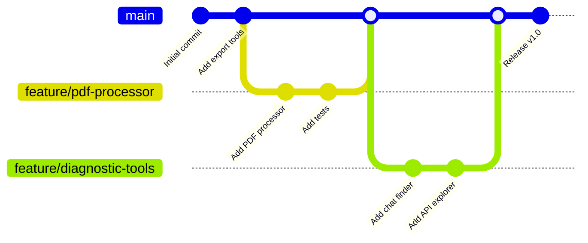
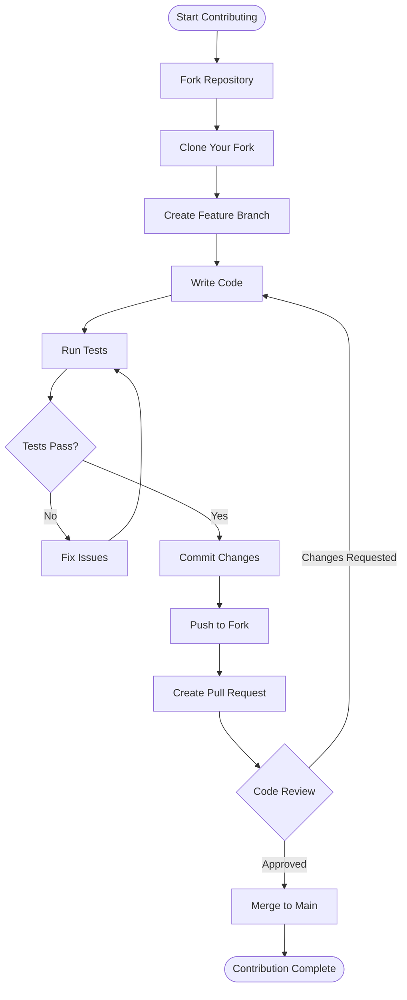
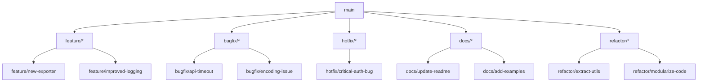
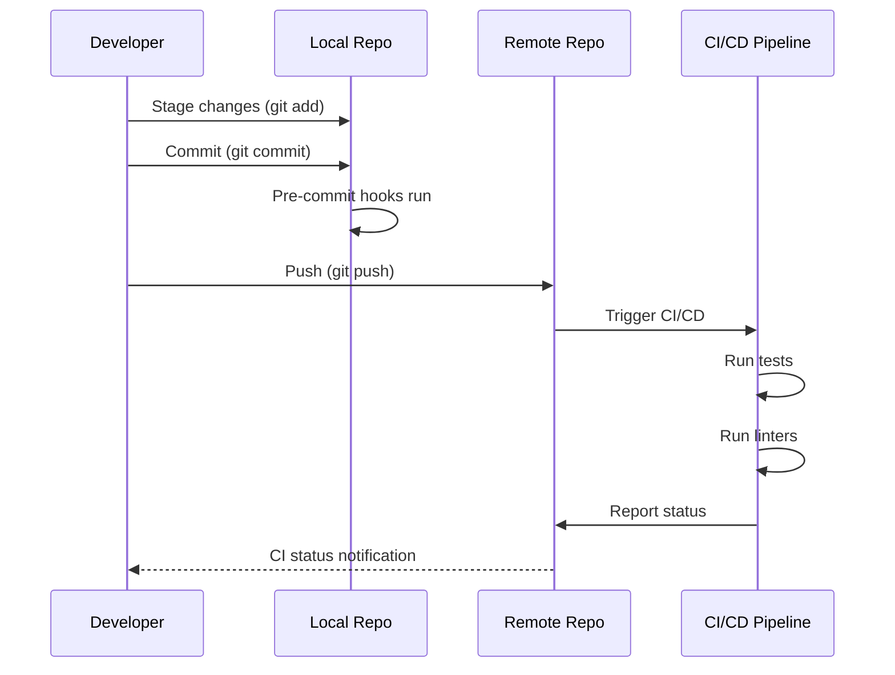
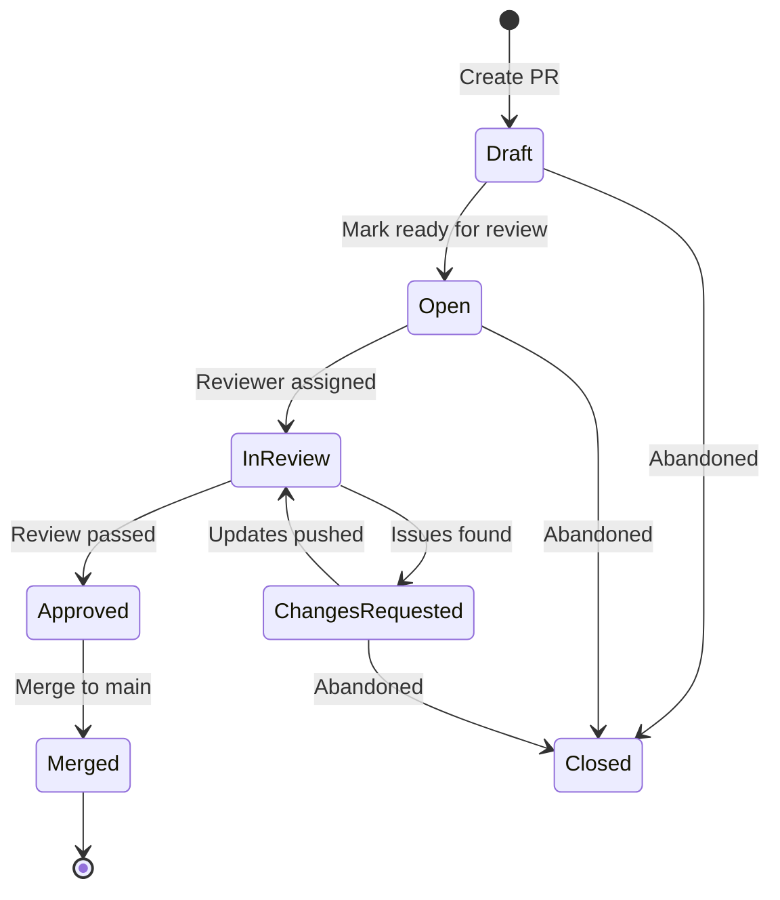
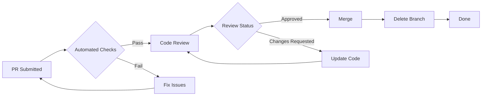
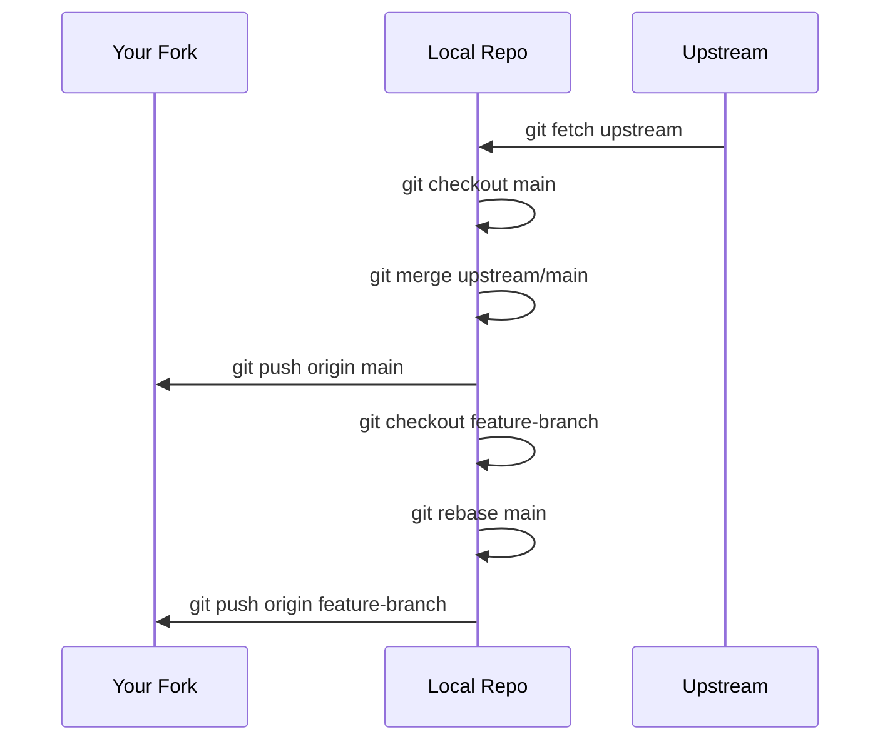
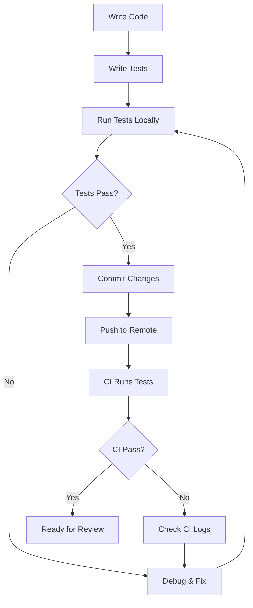
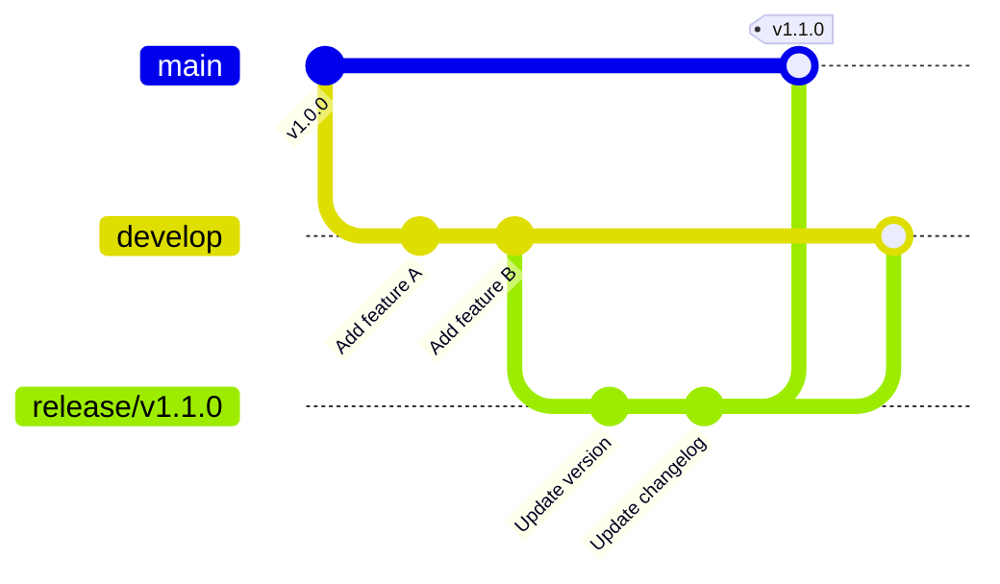
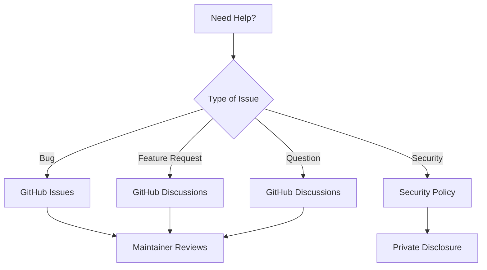

# Contributing to Abacus Chat Exporter

Thank you for your interest in contributing to this project! This guide will help you understand the development workflow and git practices.

## 📋 Table of Contents

- [Development Workflow](#development-workflow)
- [Git Workflow](#git-workflow)
- [Branching Strategy](#branching-strategy)
- [Commit Guidelines](#commit-guidelines)
- [Pull Request Process](#pull-request-process)
- [Code Style](#code-style)

## 🔄 Development Workflow

### Git Branching Workflow



### Contribution Flow



## 🌿 Branching Strategy

### Branch Types



### Branch Naming Convention

- **feature/**: New features or enhancements
  - Example: `feature/add-csv-export`

- **bugfix/**: Bug fixes
  - Example: `bugfix/fix-encoding-error`

- **hotfix/**: Critical fixes that need immediate deployment
  - Example: `hotfix/auth-vulnerability`

- **docs/**: Documentation updates
  - Example: `docs/improve-quickstart`

- **refactor/**: Code refactoring without changing functionality
  - Example: `refactor/extract-api-client`

- **claude/**: Automated branches created by Claude Code
  - Example: `claude/add-git-mermaid-diagrams-01PX6RZWMiQhzbikYDiBGzEw`
  - These follow the pattern: `claude/<description>-<session-id>`

## 📝 Commit Guidelines

### Commit Message Format

```
<type>: <subject>

<body>

<footer>
```

### Types

- **feat**: New feature
- **fix**: Bug fix
- **docs**: Documentation changes
- **style**: Code style changes (formatting, etc.)
- **refactor**: Code refactoring
- **test**: Adding or updating tests
- **chore**: Maintenance tasks

### Examples

```bash
# Good commit messages
feat: add CSV export format support
fix: resolve encoding error in chat export
docs: update installation instructions
refactor: extract API client into separate module

# Bad commit messages
update stuff
fix bug
changes
```

### Commit Workflow Diagram



## 🔀 Pull Request Process

### PR Lifecycle



### Creating a Pull Request

1. **Ensure your branch is up to date**
   ```bash
   git checkout main
   git pull origin main
   git checkout your-feature-branch
   git rebase main
   ```

2. **Push your changes**
   ```bash
   git push origin your-feature-branch
   ```

3. **Create PR with descriptive title and body**
   ```markdown
   ## Summary
   Brief description of changes

   ## Changes Made
   - Added feature X
   - Fixed bug Y
   - Updated documentation Z

   ## Testing
   - [ ] Unit tests pass
   - [ ] Manual testing completed
   - [ ] Documentation updated

   ## Related Issues
   Closes #123
   ```

### Review Process



## 🎨 Code Style

### Python Code Style

- Follow PEP 8
- Use type hints where applicable
- Maximum line length: 100 characters
- Use meaningful variable names

### Example

```python
from typing import List, Optional
from pathlib import Path


def export_chat_session(
    session_id: str,
    output_dir: Path,
    format: str = "html"
) -> Optional[Path]:
    """
    Export a chat session to the specified format.

    Args:
        session_id: The ID of the chat session to export
        output_dir: Directory to save the exported file
        format: Export format ('html' or 'json')

    Returns:
        Path to the exported file, or None if export failed
    """
    # Implementation here
    pass
```

## 🔧 Development Setup

### Initial Setup

```bash
# Clone your fork
git clone https://github.com/YOUR_USERNAME/abacus-chat-exporter.git
cd abacus-chat-exporter

# Add upstream remote
git remote add upstream https://github.com/danindiana/abacus-chat-exporter.git

# Create virtual environment
python3 -m venv venv
source venv/bin/activate

# Install dependencies
pip install -r requirements.txt

# Install development dependencies (if available)
pip install -e .[dev]
```

### Keeping Your Fork Updated

```bash
# Fetch upstream changes
git fetch upstream

# Update your main branch
git checkout main
git merge upstream/main

# Push to your fork
git push origin main
```

### Git Sync Workflow



## 🧪 Testing

### Running Tests

```bash
# Run all tests
pytest

# Run with coverage
pytest --cov=src tests/

# Run specific test file
pytest tests/test_exporters.py
```

### Testing Workflow



## 📊 Release Process

### Release Workflow



### Version Numbering

We follow [Semantic Versioning](https://semver.org/):

- **MAJOR**: Incompatible API changes
- **MINOR**: New functionality (backward compatible)
- **PATCH**: Bug fixes (backward compatible)

Example: `v1.2.3`
- 1 = Major version
- 2 = Minor version
- 3 = Patch version

## 🤝 Getting Help

### Communication Channels



- **Bugs**: Open a GitHub Issue
- **Feature Requests**: Start a GitHub Discussion
- **Questions**: GitHub Discussions or Issue comments
- **Security**: Follow responsible disclosure in SECURITY.md

## ✅ Checklist Before Submitting PR

- [ ] Code follows project style guidelines
- [ ] All tests pass locally
- [ ] Added tests for new features
- [ ] Updated documentation
- [ ] Commit messages follow guidelines
- [ ] Branch is up to date with main
- [ ] No merge conflicts
- [ ] PR description is clear and complete

## 📚 Additional Resources

- [Git Documentation](https://git-scm.com/doc)
- [GitHub Flow Guide](https://guides.github.com/introduction/flow/)
- [Conventional Commits](https://www.conventionalcommits.org/)
- [Semantic Versioning](https://semver.org/)

Thank you for contributing! 🎉
