# Git Workflow Documentation

This document provides detailed visual guides for working with git in the Abacus Chat Exporter project.

## 📚 Table of Contents

- [Repository Structure](#repository-structure)
- [Development Workflow](#development-workflow)
- [Branching Strategy](#branching-strategy)
- [Feature Development Lifecycle](#feature-development-lifecycle)
- [Collaboration Patterns](#collaboration-patterns)
- [Advanced Git Operations](#advanced-git-operations)

## 🏗️ Repository Structure

### Repository Overview

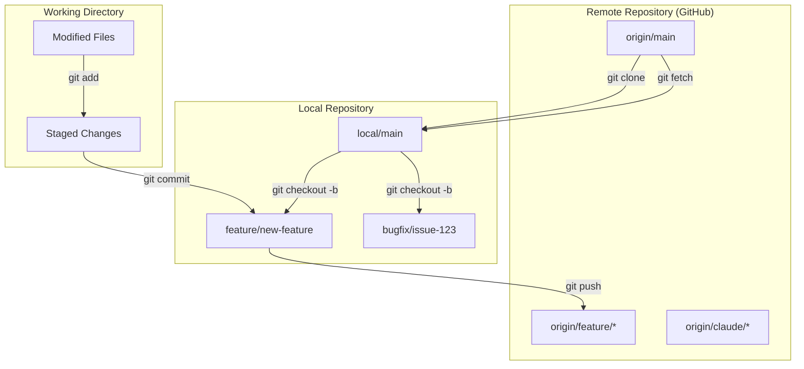

### Branch Hierarchy

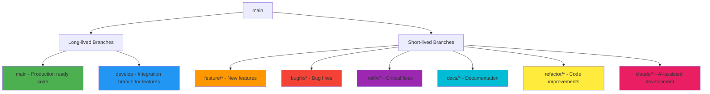

## 🔄 Development Workflow

### Complete Development Cycle

```mermaid
sequenceDiagram
    actor Dev as Developer
    participant WD as Working Directory
    participant Staging as Staging Area
    participant Local as Local Repo
    participant Remote as Remote Repo
    participant CI as CI/CD
    participant Rev as Reviewers

    Dev->>WD: Make changes
    Dev->>WD: Test locally
    Dev->>Staging: git add
    Dev->>Local: git commit -m "message"
    Dev->>Local: Run pre-commit hooks

    alt Pre-commit passes
        Dev->>Remote: git push origin branch
        Remote->>CI: Trigger pipeline
        CI->>CI: Run tests
        CI->>CI: Run linters
        CI->>CI: Build project

        alt CI passes
            CI-->>Remote: ✅ Success
            Dev->>Remote: Create Pull Request
            Remote->>Rev: Request review
            Rev->>Remote: Approve PR
            Remote->>Remote: Merge to main
        else CI fails
            CI-->>Remote: ❌ Failed
            Dev->>WD: Fix issues
        end
    else Pre-commit fails
        Local-->>Dev: ❌ Hook failed
        Dev->>WD: Fix issues
    end
```

### Daily Development Flow

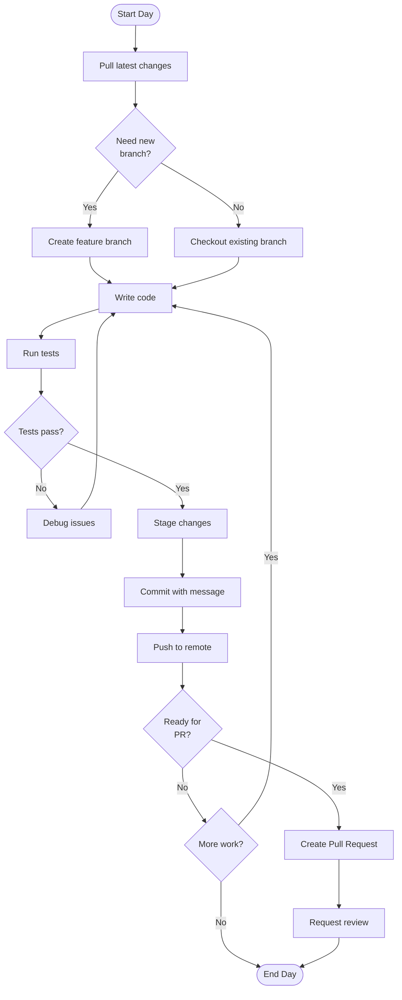

## 🌿 Branching Strategy

### Feature Branch Workflow

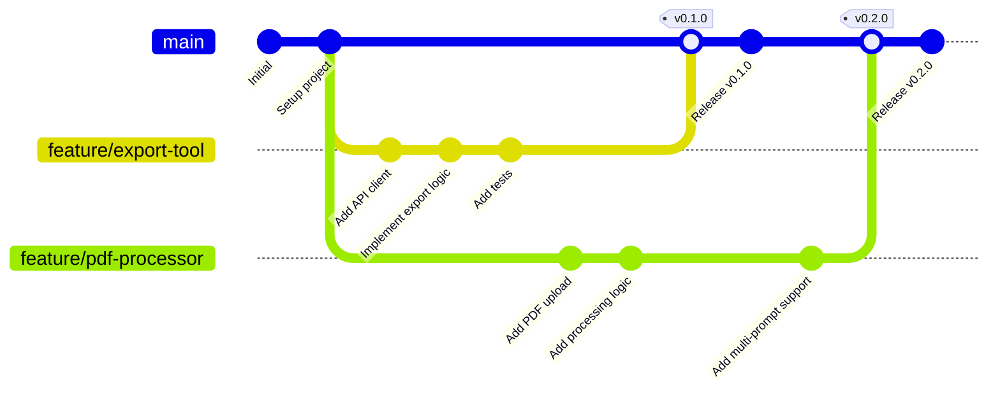

### Hotfix Workflow

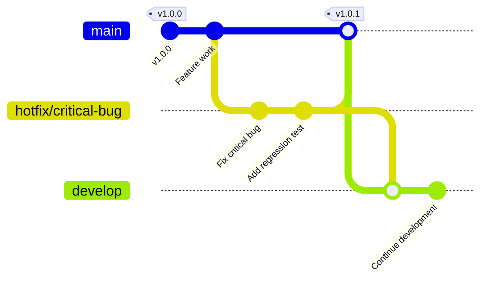

### Multi-Feature Development

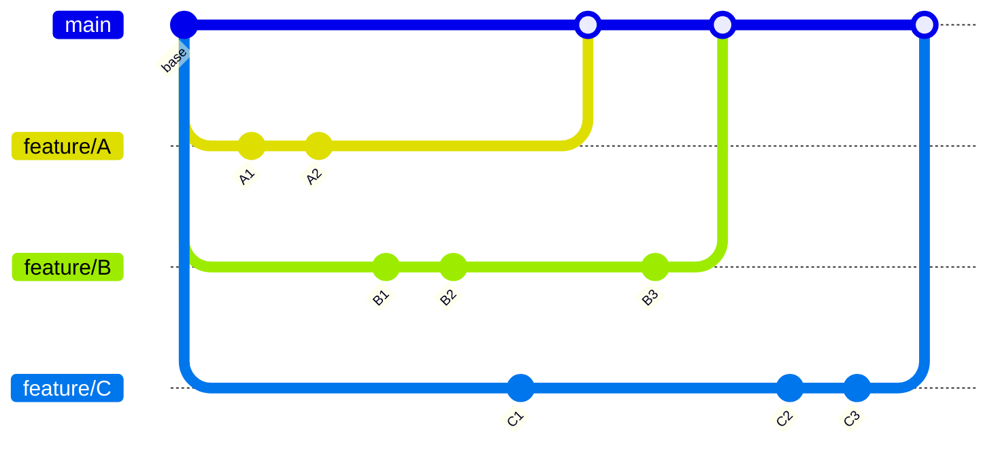

## 🔄 Feature Development Lifecycle

### From Idea to Production

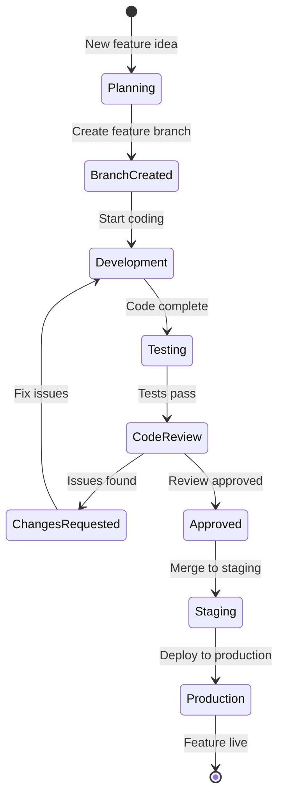

### Detailed Feature Flow

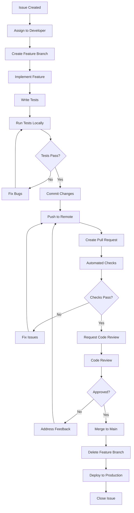

## 🤝 Collaboration Patterns

### Fork-Based Collaboration

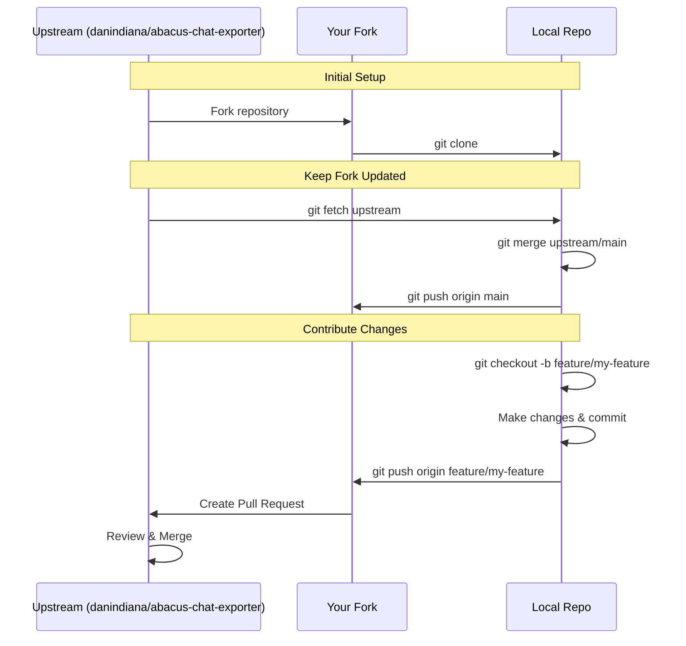

### Team Collaboration Workflow

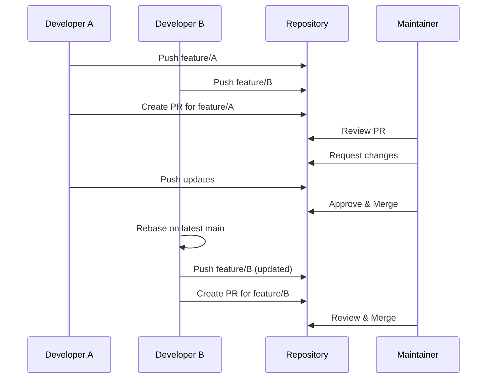

### Conflict Resolution

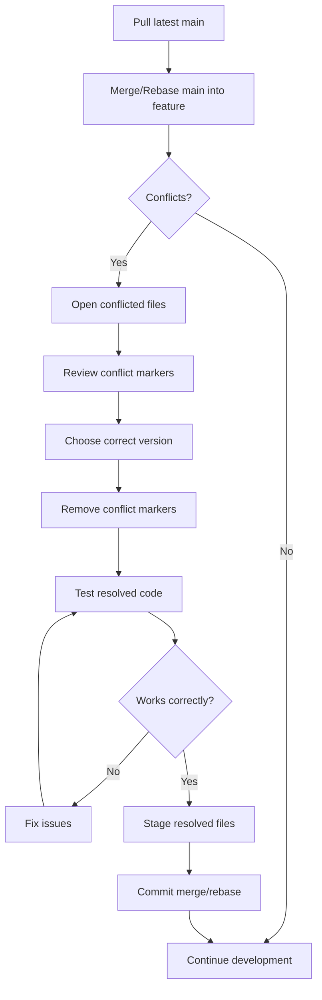

## 🎯 Advanced Git Operations

### Interactive Rebase Workflow

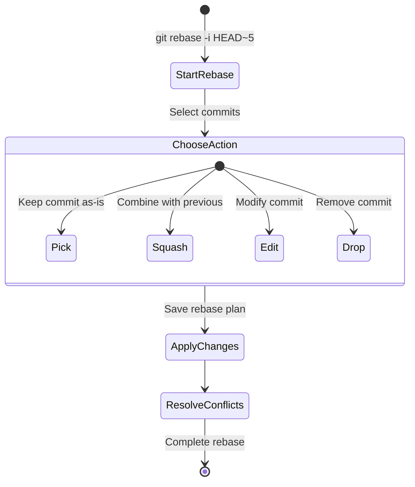

### Git Stash Workflow

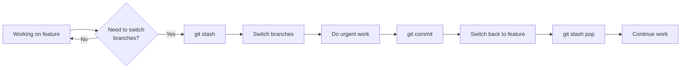

### Cherry-Pick Process

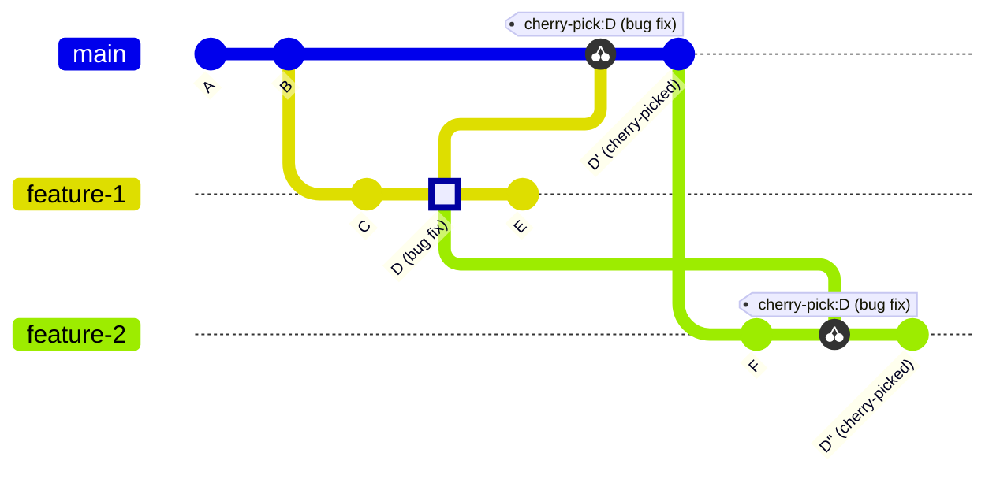

### Bisect for Bug Hunting

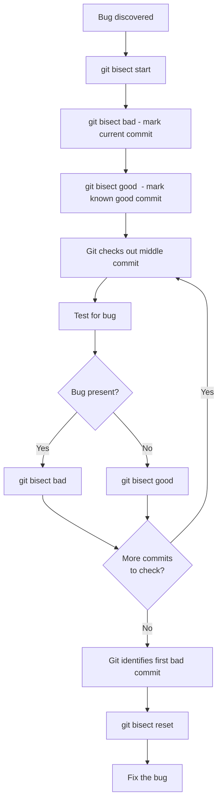

## 🔀 Merge Strategies

### Fast-Forward Merge

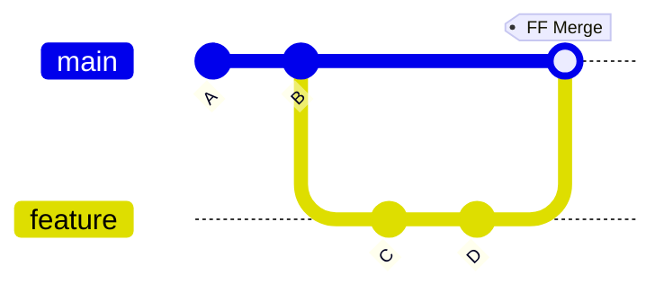

### Three-Way Merge

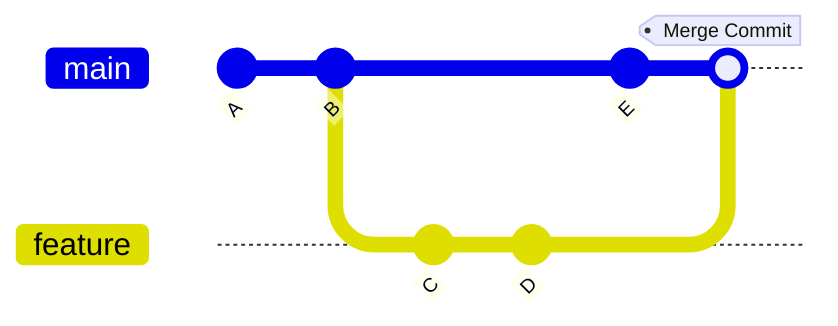

### Rebase and Merge

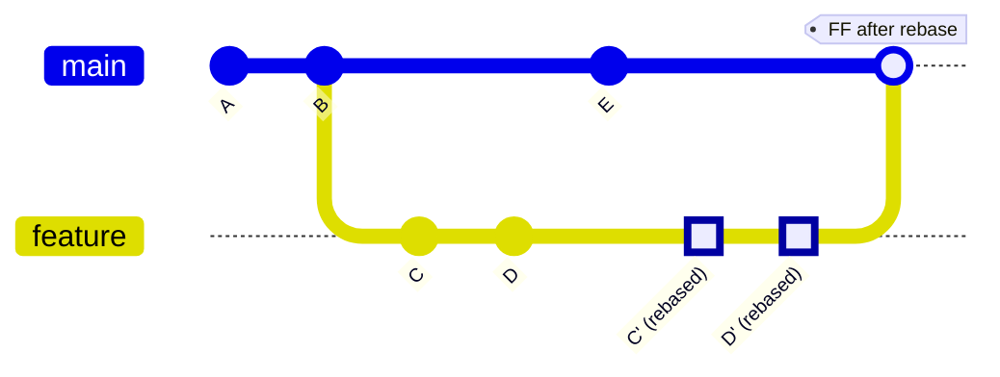

## 🔐 Tag and Release Workflow

### Semantic Versioning Tags

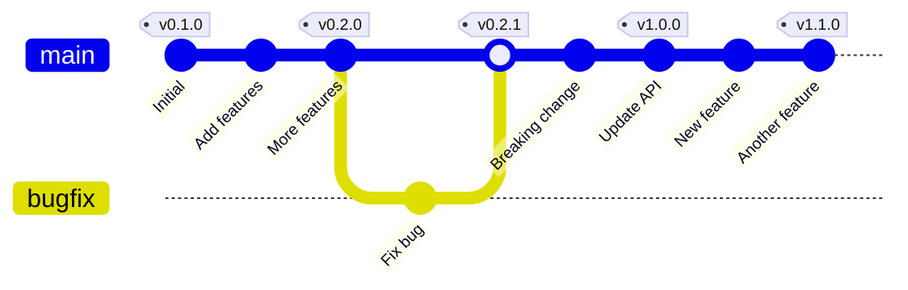

### Release Process

```mermaid
flowchart TD
    A[Feature complete] --> B[Create release branch]
    B --> C[Update version numbers]
    C --> D[Update CHANGELOG]
    D --> E[Create release commit]
    E --> F[Tag release]

    F --> G[Merge to main]
    G --> H[Deploy to production]
    H --> I[Create GitHub release]

    I --> J[Generate release notes]
    J --> K[Publish release]
    K --> L[Merge back to develop]
```

## 📊 Git History Visualization

### Understanding Git Log

```mermaid
graph LR
    A[HEAD] --> B[main]
    B --> C[commit C]
    C --> D[commit B]
    D --> E[commit A]

    F[feature/new] --> G[commit F]
    G --> H[commit E]
    H --> D

    style A fill:#ff6b6b
    style B fill:#4ecdc4
    style F fill:#95e1d3
```

### Commit Graph with Multiple Branches

```mermaid
gitGraph
    commit id: "1"
    commit id: "2"

    branch develop
    checkout develop
    commit id: "3"

    branch feature/A
    checkout feature/A
    commit id: "4"
    commit id: "5"

    checkout develop
    branch feature/B
    commit id: "6"

    checkout develop
    merge feature/A
    commit id: "7"

    checkout feature/B
    commit id: "8"

    checkout develop
    merge feature/B

    checkout main
    merge develop tag: "v1.0.0"
```

## 🛠️ Git Commands Reference

### Common Workflow Commands

```mermaid
graph TD
    A[Start] --> B{What do you<br/>want to do?}

    B -->|Create branch| C[git checkout -b name]
    B -->|Switch branch| D[git checkout name]
    B -->|View changes| E[git status / git diff]
    B -->|Stage changes| F[git add]
    B -->|Commit| G[git commit -m message]
    B -->|Push| H[git push origin branch]
    B -->|Pull updates| I[git pull origin branch]
    B -->|View history| J[git log]
    B -->|Stash changes| K[git stash]
    B -->|Merge branch| L[git merge branch]
    B -->|Rebase| M[git rebase branch]
    B -->|Tag release| N[git tag -a v1.0.0]
```

## 🎓 Best Practices

### Commit Frequency

```mermaid
timeline
    title Good Commit Practice
    section Monday
        Morning : Implement feature skeleton
        Noon : Add core functionality
        Afternoon : Add error handling
        Evening : Add tests
    section Tuesday
        Morning : Fix test failures
        Noon : Refactor code
        Afternoon : Update documentation
        Evening : Final polish
```

### Branch Lifecycle

```mermaid
gantt
    title Feature Branch Lifecycle
    dateFormat YYYY-MM-DD
    section Planning
        Create issue           :a1, 2025-01-01, 1d
    section Development
        Create branch         :a2, after a1, 1d
        Implement feature     :a3, after a2, 5d
        Write tests          :a4, after a3, 2d
    section Review
        Create PR            :a5, after a4, 1d
        Code review          :a6, after a5, 2d
        Address feedback     :a7, after a6, 1d
    section Deployment
        Merge to main        :a8, after a7, 1d
        Deploy               :a9, after a8, 1d
        Delete branch        :a10, after a9, 1d
```

## 📚 Additional Resources

- [Git Official Documentation](https://git-scm.com/doc)
- [GitHub Flow](https://guides.github.com/introduction/flow/)
- [Gitflow Workflow](https://www.atlassian.com/git/tutorials/comparing-workflows/gitflow-workflow)
- [Conventional Commits](https://www.conventionalcommits.org/)
- [Semantic Versioning](https://semver.org/)

---

**Note**: These diagrams and workflows are designed to provide visual guidance. Adapt them to fit your specific workflow and team needs.
